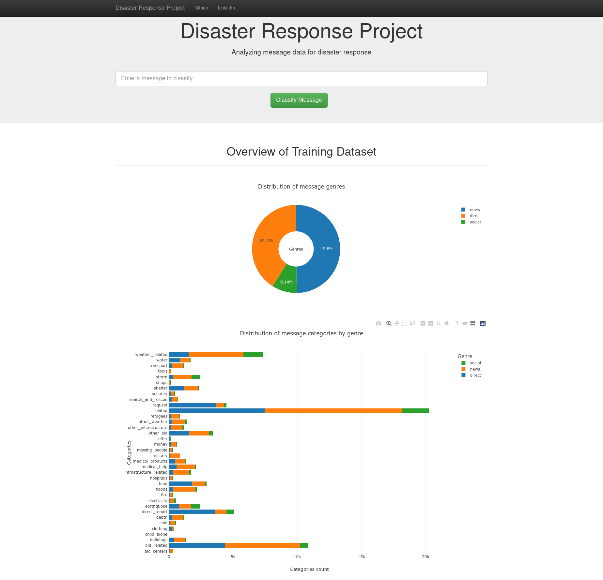
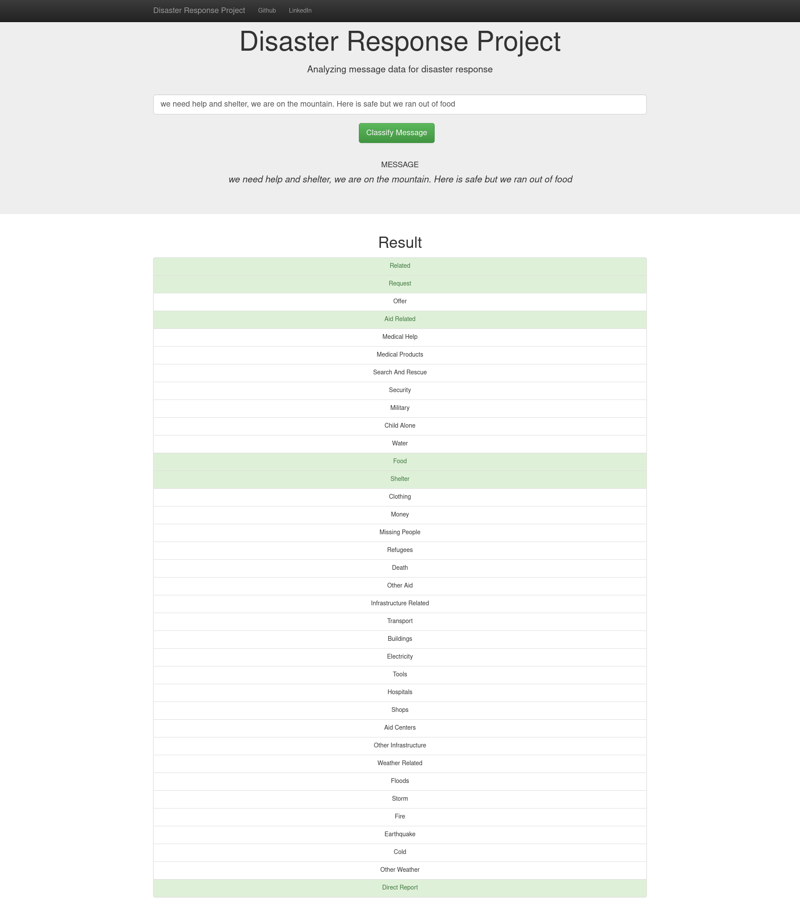

# Disaster Response Pipeline Project

## Project motivation

This project analyzes disaster data to build a model for an API that classifies disaster messages.

The project analyzes messages for disaster response. It is intended to know which type of responses organizations should take in case of a disaster. These responses are based on an individual's message in a direct request for help or on social media.

Moreover, slow responses are a matter of concern in a disaster context. Therefore, this type of project is very important because it can help organizations to prioritize resources accurately and quickly.

## Files

* data
  |- disaster_categories.csv # the raw data containing the labels for each message
  |- disaster_messages.csv # the raw data with the messages and its genres
  |- process_data.py # the script that performs the ETL operation
* graph
  |- utils.py # creates cached objects and builds serialized representations of the visuals
* models
  |- train_classifier.py # the script that builds and trains the model
* templates
  |- master.html # main page of web app
  |- go.html # classification result page of web app
* run.py # Flask file that runs the app
* README.md
* requirements.txt # project dependencies

## Instructions to reproduce it locally:

1. First of all, you must assure to install the dependencies:

```shell
    pip install -r requirements.txt
```

2. Run the following commands in the project's root directory to set up the database and model.

   - To run ETL pipeline that cleans data and stores in database:
     ```
     python data/process_data.py data/disaster_messages.csv data/disaster_categories.csv data/DisasterResponse.db
     ```
   - To run ML pipeline that trains classifier and saves it:
     ```
     python models/train_classifier.py data/DisasterResponse.db models/classifier.pkl
     ```
3. Run the web app: `python run.py`

## Other info

The messages data is **skewed**, hence the accuracy of the predictions will be affected. You can check the bar plot to make sure of it.

# Project preview





Check the [live demo](http://ec2-184-72-141-226.compute-1.amazonaws.com/)
